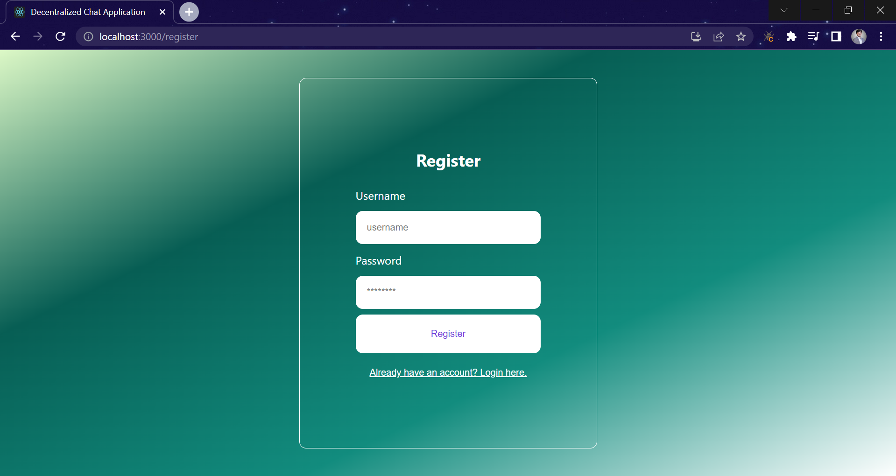
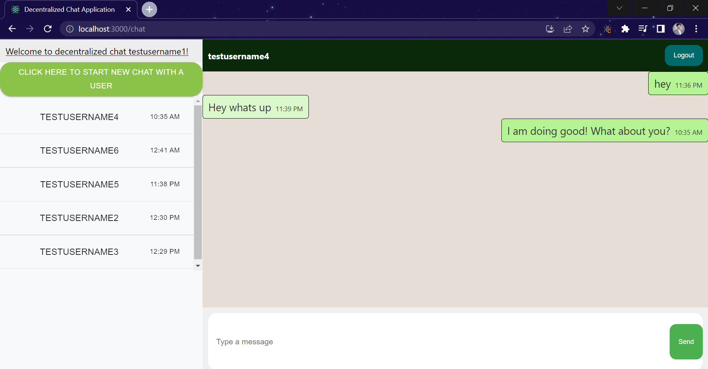

# User Registration and API-key generation

<<<<<<< HEAD

# Chat Window

=======
>>>>>>> 56d04ae8998e8a89cd3f51cfc4cae240e365c58d
This project was bootstrapped with [Create React App](https://github.com/facebook/create-react-app).

## Available Scripts

To access the UI, clone the project to your local computer using:

### `git clone https://github.com/PranitMaldikar/front-end.git`

Enter your project directory using:

### `cd front-end`

In the project directory, you can run:

### `npm install`

then

### `npm start`

Runs the app in the development mode.\
Open [http://localhost:3000](http://localhost:3000) to view it in your browser.

## Master and Minion

After running the app, use the following Master URL to check minion health:

### https://master.chat.junglesucks.com/alive

Minion URLs to check messages:

### https://cabinet.minion.chat.junglesucks.com/messages

### https://lecture.minion.chat.junglesucks.com/messages

Minion URLs to check users:

### https://cabinet.minion.chat.junglesucks.com/users

### https://lecture.minion.chat.junglesucks.com/users
